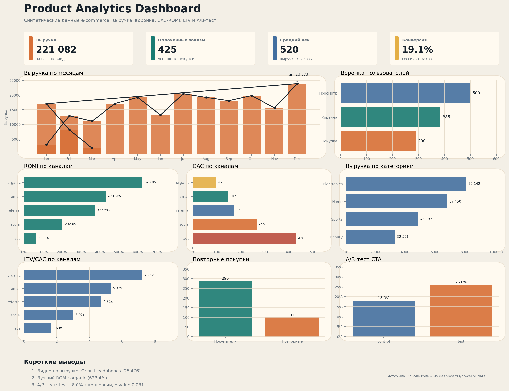

# Пет-проект по продуктовой аналитике

Финальная портфолио-версия учебного проекта по аналитике e-commerce продукта.

Проект показывает полный аналитический цикл: генерация данных, проектирование базы, загрузка в PostgreSQL, SQL-анализ, Python/EDA, подготовка BI-витрин, dashboard и бизнес-рекомендации.

## Статус

Проект завершен как первая портфолио-работа для позиции аналитика данных / продуктового аналитика.

## Бизнес-задача

Мы анализируем условный интернет-магазин и отвечаем на вопросы:

- как пользователи проходят продуктовую воронку
- какие месяцы дают больше выручки и заказов
- какие каналы привлечения дают больше денег
- какие каналы окупаются с учетом маркетинговых расходов
- сколько пользователей покупают повторно
- какой LTV и LTV/CAC у разных каналов
- можно ли раскатывать тестовую CTA-кнопку по результатам A/B-теста

## Стек

- PostgreSQL
- SQL
- Python
- pandas
- NumPy
- matplotlib
- seaborn
- Jupyter Notebook
- Power BI-ready CSV
- Git и GitHub

## Дашборд

В проект добавлена портфолио-версия dashboard:

- [HTML-дашборд](dashboards/product_analytics_dashboard.html)
- [PNG-превью](dashboards/screenshots/product_analytics_dashboard.png)
- [BI-датасеты](dashboards/powerbi_data/)
- [Инструкция для Power BI](docs/powerbi_dashboard_guide.md)



## Модель данных

Проект использует восемь таблиц:

- `users` - пользователи и канал привлечения
- `products` - каталог товаров
- `marketing_spend` - расходы на привлечение по каналам
- `ab_test_assignments` - данные A/B-теста
- `sessions` - пользовательские сессии
- `events` - события `view_item`, `add_to_cart`, `purchase`
- `orders` - заказы
- `order_items` - товары внутри заказов

## Ключевые метрики

- Пользователи: 500
- Сессии: 2 225
- Оплаченные заказы: 425
- События: 6 752
- Выручка: 221 082.40
- Средний чек: 520.19
- Конверсия из сессии в заказ: 19.10%
- Маркетинговые расходы: 65 500.00
- Общий ROMI: 237.53%
- Повторные покупатели: 100
- Доля повторных покупателей: 34.48%
- LTV на пользователя: 442.16
- LTV на покупателя: 762.35

## Основные выводы

### Воронка

Воронка `view_item -> add_to_cart -> purchase`:

- просмотр товара: 500 пользователей
- добавление в корзину: 385 пользователей
- покупка: 290 пользователей
- конверсия из просмотра в корзину: 77.00%
- конверсия из корзины в покупку: 75.32%
- конверсия из просмотра в покупку: 58.00%

Основная зона внимания - переход от просмотра товара к добавлению в корзину.

### Каналы привлечения

Лучшие каналы по выручке:

- `referral`: 51 970.96
- `social`: 51 335.17
- `email`: 45 207.53

Лучший канал по ROMI:

- `organic`: 623.41%

Самый дорогой канал по CAC:

- `ads`: 429.82

### LTV и повторные покупки

Повторные покупатели дают 127 706.04 выручки, это 57.76% всей выручки.

Лучшие каналы по LTV/CAC:

- `organic`: 7.23x
- `email`: 5.32x
- `referral`: 4.72x

`ads` имеет LTV/CAC 1.63x, поэтому рекламный бюджет стоит оптимизировать.

### A/B-тест

Эксперимент: новая CTA-кнопка на карточке товара.

- control: конверсия 18.00%
- test: конверсия 26.00%
- абсолютный uplift: +8.00 п.п.
- относительный uplift: +44.44%
- p-value: 0.031

Результат статистически значим на уровне 5%, поэтому тестовый вариант можно рекомендовать к раскатке с последующим мониторингом.

## Структура репозитория

- `data/sample/` - синтетические CSV-данные
- `sql/` - схема БД, загрузка данных, проверки, аналитические запросы и views
- `notebooks/` - Jupyter Notebook и EDA-скрипт
- `dashboards/figures/` - графики из Python EDA
- `dashboards/powerbi_data/` - подготовленные CSV-витрины для BI
- `dashboards/product_analytics_dashboard.html` - статический dashboard
- `dashboards/screenshots/` - превью dashboard
- `docs/` - описание проекта, roadmap, итоговый отчет и выводы
- `scripts/` - генерация данных, BI-витрин, notebook и dashboard

## Основные файлы

SQL:

- [Схема базы данных](sql/01_create_schema.sql)
- [Загрузка данных](sql/03_load_data.sql)
- [Проверочные запросы](sql/04_validation_queries.sql)
- [Продуктовый анализ](sql/05_product_analysis.sql)
- [Views для BI](sql/06_powerbi_views.sql)

Python:

- [Генератор данных](scripts/generate_sample_data.py)
- [Экспорт BI-витрин](scripts/export_powerbi_data.py)
- [Генератор dashboard](scripts/build_portfolio_dashboard.py)
- [EDA notebook](notebooks/01_eda_analysis.ipynb)
- [EDA script](notebooks/eda_analysis.py)

Документация:

- [Финальный отчет](docs/final_report.md)
- [Итоги анализа](docs/analysis_summary.md)
- [Описание проекта](docs/project_scope.md)
- [Roadmap](docs/roadmap.md)
- [Инструкция по Power BI](docs/powerbi_dashboard_guide.md)

## Как воспроизвести

Установить зависимости:

```bash
pip install -r requirements.txt
```

Сгенерировать данные:

```bash
python scripts/generate_sample_data.py
```

Подготовить BI-витрины:

```bash
python scripts/export_powerbi_data.py
```

Собрать dashboard:

```bash
python scripts/build_portfolio_dashboard.py
```

Создать схему PostgreSQL:

```sql
\i 'C:/Users/iliya/Desktop/product-analytics-pet-project/sql/01_create_schema.sql'
```

Загрузить данные:

```sql
\i 'C:/Users/iliya/Desktop/product-analytics-pet-project/sql/03_load_data.sql'
```

Запустить полный SQL-анализ:

```sql
\i 'C:/Users/iliya/Desktop/product-analytics-pet-project/sql/05_product_analysis.sql'
```

## Что можно развить дальше

Для следующего проекта логично перейти к более реалистичному рабочему стеку: ClickHouse, более крупные event-данные, настоящая BI-система и отдельный блок продуктовых гипотез.
